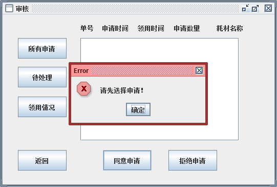
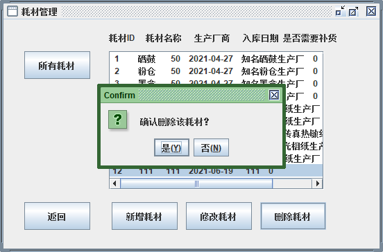

# 办公室耗材管理系统

<br>

## ✨界面展示

<br>

### 主界面


<br>

### 登录界面


<br>

### 选择功能模块


<br>

### 审核





<br>

### 员工管理


<br>

### 耗材管理





<br>

## ✨项目配置

```java
/**
 * @author Flat-White
 */
```

<br>

### 开发环境

- MySQL5.7

- jdk1.8

- Mybatis

- JFormDesigner（GUI）

<br>

### maven依赖

```xml
    <dependencies>
    <!--        mysql驱动-->
    <dependency>
        <groupId>mysql</groupId>
        <artifactId>mysql-connector-java</artifactId>
        <version>5.1.49</version>
    </dependency>
    <!--        mybatis-->
    <dependency>
        <groupId>org.mybatis</groupId>
        <artifactId>mybatis</artifactId>
        <version>3.5.7</version>
    </dependency>
    <!--        junit-->
    <dependency>
        <groupId>junit</groupId>
        <artifactId>junit</artifactId>
        <version>3.8.2</version>
        <scope>test</scope>
    </dependency>
    <!--        commons-lang3-->
    <dependency>
        <groupId>org.apache.commons</groupId>
        <artifactId>commons-lang3</artifactId>
        <version>3.12.0</version>
    </dependency>
</dependencies>
```

<br>

### mybatis-config

```xml
<?xml version="1.0" encoding="UTF-8" ?>
<!DOCTYPE configuration
        PUBLIC "-//mybatis.org//DTD Config 3.0//EN"
        "http://mybatis.org/dtd/mybatis-3-config.dtd">
<configuration>
    <properties resource="db.properties"/>
    <settings>
        <setting name="mapUnderscoreToCamelCase" value="true"/>
    </settings>
    <typeAliases>
        <package name="com.ocms.pojo"/>
    </typeAliases>
    <environments default="development">
    <environment id="development">
        <transactionManager type="JDBC"/>
        <dataSource type="POOLED">
            <property name="driver" value="${driver}"/>
            <property name="url" value="${url}"/>
            <property name="username" value="${username}"/>
            <property name="password" value="${password}"/>
        </dataSource>
    </environment>
    </environments>
    <mappers>
        <package name="com.ocms.dao"/>
    </mappers>
</configuration>
```

<br>

## ✨Admin端功能概述

<br>

### 登陆

<br>

### 审核

- 同意申请
- 拒绝申请

### 查看申请情况

- 查询所有申请情况
- 查询未处理申请
- 查询某员工领用情况

### 员工管理

- 查询所有员工信息
- 修改员工信息
- 新增员工
- 删除员工

### 耗材管理

- 查询所有耗材信息
- 修改耗材信息
- 新增耗材
- 删除耗材

<br>

## ✨接口总览

<br>

### Admin interface

```java
package com.ocms.dao;

import com.ocms.pojo.Admin;
import com.ocms.pojo.Apply;
import com.ocms.pojo.Consume;
import com.ocms.pojo.Staff;

import java.util.List;
import java.util.Map;

/**
 * @author Flat-White
 */
public interface AdminMapper {

    /**
     * 管理员登陆
     * @param map adminAccount adminPasswd
     * @return Admin Object
     */
    Admin adminLogin(Map<String, Object> map);

    /**
     * 管理员获取apply中相应的staId
     * @param map staId
     * @return staId
     */
    int adminGetStaIdByApplyId(Map<String, Object> map);

    /**
     * 管理员同意申请
     * @param map applyId adminId applyNote
     * @return update success->1 / fail -> 0
     */
    int adminAgreeApply(Map<String, Object> map);

    /**
     * 管理员拒绝申请
     * @param map applyId adminId applyNote
     * @return update success->1 / fail -> 0
     */
    int adminRejectApply(Map<String, Object> map);

    /**
     * 管理员加密密码
     * @return encrypt success->1 / fail -> 0
     */
    int adminEncryptPasswd();

    /**
     * 查询所有申请情况
     * @return Apply list
     */
    List<Apply> adminListApply();

    /**
     * 管理员查询已处理申请
     * @return Apply List
     */
    List<Apply> adminGetTreatApply();

    /**
     * 管理员查询未处理申请
     * @return Apply List
     */
    List<Apply> adminGetUnTreatApply();

    /**
     * 查询某员工申请情况
     * @param map staName
     * @return Apply Object
     */
    List<Apply> adminGetApplyByStaName(Map<String, Object> map);

    /**
     * 查询所有员工信息
     * @return Staff list
     */
    List<Staff> adminListStaff();

    /**
     * 修改员工信息
     * @param map staId staName staDept staTele
     * @return update success->1 / fail -> 0
     */
    int adminUpdateStaff(Map<String, Object> map);

    /**
     * 增加员工
     * @param map staName staDept staTele
     * @return add success->1 / fail -> 0
     */
    int adminInsertStaff(Map<String, Object> map);

    /**
     * 删除员工
     * @param map staId
     * @return del success->1 / fail -> 0
     */
    int adminDeleteStaff(Map<String, Object> map);

    /**
     * 查询所有耗材信息
     * @return Consume list
     */
    List<Consume> adminListConsume();

    /**
     * 修改耗材数量
     * @param map conId conName conNum conFactory
     * @return update success->1 / fail -> 0
     */
    int adminUpdateConsume(Map<String, Object> map);

    /**
     * 新增耗材
     * @param map conName conNum conFactory
     * @return add success->1 / fail -> 0
     */
    int adminInsertConsume(Map<String, Object> map);

    /**
     * 删除耗材
     * @param map conId
     * @return del success->1 / fail -> 0
     */
    int adminDeleteConsume(Map<String, Object> map);
}
```

### Staff interface

```java
package com.ocms.dao;

import com.ocms.pojo.Apply;
import com.ocms.pojo.Staff;

import java.util.List;
import java.util.Map;

/**
 * @author Flat-White
 */
public interface StaffMapper {
    /**
     * 查询所有员工信息
     * @return Staff list
     */
    List<Staff> staffListStaff();

    /**
     * 查询某个员工信息
     * @param map staName
     * @return Staff Object
     */
    Staff staffGetStaffByStaName(Map<String, Object> map);

    /**
     * 提交申请
     * @param map staId conTime applyName applyNum
     * @return apply success->1 / fail -> 0
     */
    int staffSubmitApply(Map<String, Object> map);

    /**
     * 查询审核情况
     * @param map staId
     * @return Apply list
     */
    List<Apply> staffQueryApply(Map<String, Object> map);
}
```

<br>

## ✨建库SQL

```mysql
/*
 Navicat Premium Data Transfer

 Source Server         : dbms
 Source Server Type    : MySQL
 Source Server Version : 50731
 Source Host           : localhost:3306
 Source Schema         : ocms

 Target Server Type    : MySQL
 Target Server Version : 50731
 File Encoding         : 65001

 Date: 19/05/2021 00:43:07
*/

SET NAMES utf8mb4;
SET FOREIGN_KEY_CHECKS = 0;

-- ----------------------------
-- Table structure for admin
-- ----------------------------
DROP TABLE IF EXISTS `admin`;
CREATE TABLE `admin` (
  `admin_id` int(11) NOT NULL AUTO_INCREMENT,
  `admin_account` varchar(30) NOT NULL,
  `admin_passwd` char(50) NOT NULL,
  PRIMARY KEY (`admin_id`) USING BTREE
) ENGINE=InnoDB AUTO_INCREMENT=5 DEFAULT CHARSET=utf8mb4 ROW_FORMAT=DYNAMIC;

-- ----------------------------
-- Records of admin
-- ----------------------------
BEGIN;
INSERT INTO `admin` VALUES (1, 'root', '63a9f0ea7bb98050796b649e85481845');
INSERT INTO `admin` VALUES (2, 'admin', '21232f297a57a5a743894a0e4a801fc3');
INSERT INTO `admin` VALUES (3, 'kali', 'd6ca3fd0c3a3b462ff2b83436dda495e');
INSERT INTO `admin` VALUES (4, 'ubuntu', '1d41c853af58d3a7ae54990ce29417d8');
COMMIT;

-- ----------------------------
-- Table structure for apply
-- ----------------------------
DROP TABLE IF EXISTS `apply`;
CREATE TABLE `apply` (
  `apply_id` int(11) NOT NULL AUTO_INCREMENT,
  `sta_id` int(11) NOT NULL,
  `admin_id` int(11) DEFAULT NULL,
  `con_id` int(11) NOT NULL,
  `apply_time` datetime NOT NULL,
  `con_time` datetime NOT NULL,
  `apply_num` int(11) NOT NULL,
  `apply_name` varchar(20) NOT NULL,
  `apply_is_check` int(11) NOT NULL,
  `apply_result` int(11) DEFAULT NULL,
  `apply_note` varchar(100) DEFAULT NULL,
  PRIMARY KEY (`apply_id`) USING BTREE,
  KEY `FK_Apply` (`con_id`) USING BTREE,
  KEY `FK_Apply2` (`sta_id`) USING BTREE,
  KEY `FK_Apply3` (`admin_id`) USING BTREE,
  CONSTRAINT `FK_Apply` FOREIGN KEY (`con_id`) REFERENCES `consume` (`con_id`),
  CONSTRAINT `FK_Apply2` FOREIGN KEY (`sta_id`) REFERENCES `staff` (`sta_id`),
  CONSTRAINT `FK_Apply3` FOREIGN KEY (`admin_id`) REFERENCES `admin` (`admin_id`)
) ENGINE=InnoDB AUTO_INCREMENT=4 DEFAULT CHARSET=utf8mb4 ROW_FORMAT=DYNAMIC;

-- ----------------------------
-- Records of apply
-- ----------------------------
BEGIN;
INSERT INTO `apply` VALUES (1, 1, NULL, 3, '2021-04-28 10:10:35', '2021-04-28 10:10:41', 10, '墨盒', 0, NULL, NULL);
INSERT INTO `apply` VALUES (2, 2, NULL, 5, '2021-04-28 10:12:15', '2021-04-28 10:12:21', 10, '复印纸', 0, NULL, NULL);
INSERT INTO `apply` VALUES (3, 1, NULL, 7, '2021-05-19 00:42:06', '2021-05-19 00:42:05', 20, '传真热敏纸', 0, NULL, NULL);
COMMIT;

-- ----------------------------
-- Table structure for consume
-- ----------------------------
DROP TABLE IF EXISTS `consume`;
CREATE TABLE `consume` (
  `con_id` int(11) NOT NULL AUTO_INCREMENT,
  `con_name` varchar(20) NOT NULL,
  `con_num` int(11) NOT NULL,
  `con_factory` varchar(50) NOT NULL,
  `con_indate` datetime NOT NULL,
  `con_is_replenish` int(11) NOT NULL,
  PRIMARY KEY (`con_id`) USING BTREE
) ENGINE=InnoDB AUTO_INCREMENT=11 DEFAULT CHARSET=utf8mb4 ROW_FORMAT=DYNAMIC;

-- ----------------------------
-- Records of consume
-- ----------------------------
BEGIN;
INSERT INTO `consume` VALUES (1, '硒鼓', 50, '知名硒鼓生产厂', '2021-04-27 22:40:12', 0);
INSERT INTO `consume` VALUES (2, '粉仓', 50, '知名粉仓生产厂', '2021-04-27 22:40:59', 0);
INSERT INTO `consume` VALUES (3, '墨盒', 50, '知名墨盒生产厂', '2021-04-27 22:41:30', 0);
INSERT INTO `consume` VALUES (4, '碳带', 50, '知名碳带生产厂', '2021-04-27 22:42:21', 0);
INSERT INTO `consume` VALUES (5, '复印纸', 50, '知名复印纸生产厂', '2021-04-27 22:43:00', 0);
INSERT INTO `consume` VALUES (6, '彩喷纸', 50, '知名彩喷纸生产厂', '2021-04-27 22:43:28', 0);
INSERT INTO `consume` VALUES (7, '传真热敏纸', 50, '知名传真热敏纸生产厂', '2021-04-27 22:43:52', 0);
INSERT INTO `consume` VALUES (8, '高光相纸', 50, '知名高光相纸生产厂', '2021-04-27 22:44:28', 0);
INSERT INTO `consume` VALUES (9, '绘图纸', 50, '知名绘图纸生产厂', '2021-04-27 22:44:56', 0);
INSERT INTO `consume` VALUES (10, '硫酸纸', 50, '知名硫酸纸生产厂', '2021-04-27 22:45:21', 0);
COMMIT;

-- ----------------------------
-- Table structure for staff
-- ----------------------------
DROP TABLE IF EXISTS `staff`;
CREATE TABLE `staff` (
  `sta_id` int(11) NOT NULL AUTO_INCREMENT,
  `sta_name` varchar(20) NOT NULL,
  `sta_dept` varchar(20) NOT NULL,
  `sta_tele` char(20) NOT NULL,
  PRIMARY KEY (`sta_id`) USING BTREE
) ENGINE=InnoDB AUTO_INCREMENT=20 DEFAULT CHARSET=utf8mb4 ROW_FORMAT=DYNAMIC;

-- ----------------------------
-- Records of staff
-- ----------------------------
BEGIN;
INSERT INTO `staff` VALUES (1, '仓库管理员', '仓库', '000000');
INSERT INTO `staff` VALUES (2, '总裁', '行政部', '666666');
INSERT INTO `staff` VALUES (3, '董事长', '行政部', '666666');
INSERT INTO `staff` VALUES (4, 'CEO', '行政部', '666666');
INSERT INTO `staff` VALUES (5, '摸鱼产品一号职工', '产品部', '111');
INSERT INTO `staff` VALUES (6, '划水产品二号职工', '产品部', '111');
INSERT INTO `staff` VALUES (7, '摸鱼设计一号职工', '设计部', '222');
INSERT INTO `staff` VALUES (8, '划水设计二号职工', '设计部', '666');
INSERT INTO `staff` VALUES (9, '摸鱼技术一号职工', '技术部', '222');
INSERT INTO `staff` VALUES (10, '划水技术二号职工', '技术部', '333');
INSERT INTO `staff` VALUES (11, '不摸鱼技术三号', '技术部', '444');
INSERT INTO `staff` VALUES (12, '不划水技术四号职工', '技术部', '444');
INSERT INTO `staff` VALUES (13, '摸鱼市场一号职工', '市场部', '444');
INSERT INTO `staff` VALUES (14, '划水市场二号职工', '市场部', '444');
INSERT INTO `staff` VALUES (15, '绝不摸鱼财务一号职工', '财务部', '555');
INSERT INTO `staff` VALUES (16, '必不划水财务二号职工', '财务部', '555');
INSERT INTO `staff` VALUES (17, '整天摸鱼人力一号职工', '人力部', '777');
INSERT INTO `staff` VALUES (18, '想要放假人力二号职工', '人力部', '777');
INSERT INTO `staff` VALUES (19, '快被解雇人力三号职工', '人力部', '888');
COMMIT;

-- ----------------------------
-- Triggers structure for table consume
-- ----------------------------
DROP TRIGGER IF EXISTS `before_insert_auto_check_replenish`;
delimiter ;;
CREATE TRIGGER `before_insert_auto_check_replenish` BEFORE INSERT ON `consume` FOR EACH ROW BEGIN
   IF
      ( new.con_num < 10 ) THEN
         SET new.con_is_replenish = 1;
      
   END IF;
   
   END
;;
delimiter ;

-- ----------------------------
-- Triggers structure for table consume
-- ----------------------------
DROP TRIGGER IF EXISTS `after_insert_auto_apply_replenish`;
delimiter ;;
CREATE TRIGGER `after_insert_auto_apply_replenish` AFTER INSERT ON `consume` FOR EACH ROW BEGIN
   IF(new.con_is_replenish = 1) THEN
   INSERT INTO apply
   (sta_id, con_id, apply_time, con_time, apply_num, apply_name, apply_is_check)
   SELECT 1, new.con_id, NOW(), NOW(), 50, new.con_name, 0 
   FROM staff, apply
   WHERE staff.sta_id = apply.sta_id
   LIMIT 1;
   END IF;
   
   END
;;
delimiter ;

-- ----------------------------
-- Triggers structure for table consume
-- ----------------------------
DROP TRIGGER IF EXISTS `before_update_auto_check_replenish`;
delimiter ;;
CREATE TRIGGER `before_update_auto_check_replenish` BEFORE UPDATE ON `consume` FOR EACH ROW BEGIN
   IF
      ( new.con_num < 10 ) THEN
         SET new.con_is_replenish = 1;
      
   END IF;
   
   END
;;
delimiter ;

-- ----------------------------
-- Triggers structure for table consume
-- ----------------------------
DROP TRIGGER IF EXISTS `after_update_auto_apply_replenish`;
delimiter ;;
CREATE TRIGGER `after_update_auto_apply_replenish` AFTER UPDATE ON `consume` FOR EACH ROW BEGIN
   IF(new.con_is_replenish = 1) THEN
   INSERT INTO apply
   (sta_id, con_id, apply_time, con_time, apply_num, apply_name, apply_is_check)
   SELECT 1, new.con_id, NOW(), NOW(), 50, new.con_name, 0 
   FROM staff, apply
   WHERE staff.sta_id = apply.sta_id
   LIMIT 1;
   END IF;
   
   END
;;
delimiter ;

SET FOREIGN_KEY_CHECKS = 1;
```

